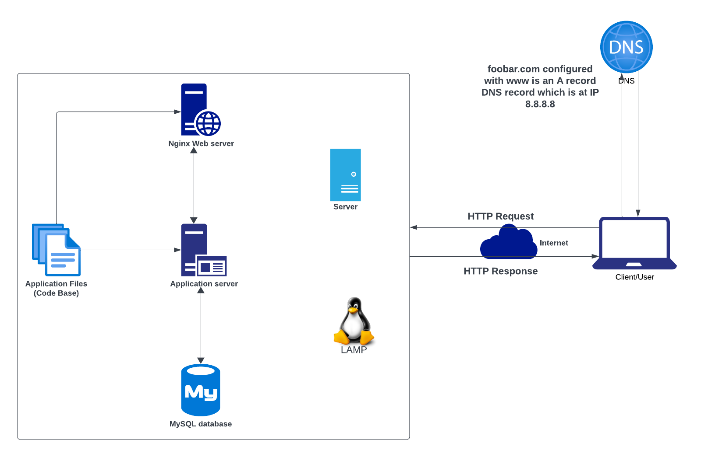

# Simple Web Infrastructure

[view whiteboard](https://imgur.com/N8trCQh0)

## Task Description
This is a project that describes a simple web framework hosting a website accessible through 'www.foobar.com'. The server lacks both firewall and SSL certifcates to safeguard its network. The following are the requirements of this simple web infrastructure;
- 1 server
- 1 web server (Nginx)
- 1 application server
- 1 application files (the code base)
- 1 database (MySQL)
- 1 domain name foobar.com configured with a www record that points to your server IP 8.8.8.8

## Explanation of the Infrastructure specifics
- **Server(What is a server?)**  
A server is either a computer hardware or software that delivers services to other computers also known as 'clients/user'. In the case of this simple web framework it has only one server.
- **Domain Name(What is the role of the domain name?)**  
A domain name is the human-readable form of an IP Address. An example is the doamin name 'www.foobar.com' which is a more recognisable alias to '8.8.8.8'. The linking of IP addresses to domain name aliases is mnaged in the Domain Name System (DNS).
- **DNS Record(What type of DNS record www is in www.foobar.com?)**  
DNS record is a stores a hostbname along with its corresponding IP address and there are several types of DNS records, but in the context of this simple web framework, the DNS record for 'www.foobar.com' is classified as an A record; an A record also know as Address record is a DNS host record that stores the hostname along with its corresponding IPv4 address.
- **Web server(What is the role of the web server?)**  
A web server can be a software or hardware form responsible for receiving requests through HTTP or HTTPS(secure) and providing the content of the request or an error message as a response. In this simple web framework 1 Nginx web server is used.
- **Application server(What is the role of the application server?)**  
An application server installs, operates and host applications and related services for end users, IT services and organisations. It facilitates the hosting and delivery of sophisticated and consumer or business applications. 1 application server is used in this simple web framweork.
- **Database(What is the role of the database?)**  
A database maintains an organised collection of information that is easily accessible, manageable and updatable. In this simple web infrastructure, 1 MySQL databse is used.
- **What is the server using to communicate with the computer of the user requesting the website?**  
The server and the computer(client/user) communicates over or via the internet network using TCP/IP protocol suite.

## Issues with this simple web infrastructure
- **SPOF(Single Point of Failure)**  
From this simple web framework, there are serveral instances of Single Points of Failure (SPOF), some of which includes, the MySQL database server experiencing a downtime resulting to a complete outage of the entire site, others include; server failure, codebase issues(bugs), web server(Nginx) failure and much more.
- **Downtime when maintenance is needed (like deploying new code web server needs to be restarted)**  
During maintenace checks of any component of the framework, that component must be taken offline or the entire server has to be shut down due to the fact that there is only one server, thereby resulting in downtime of the website.
- **High Traffic Scalability Challenge**  
Since this framework relies on one server, scaling the infrastructure is challenging, and when the server is faced with high volume of incoming requests, it faces exhaustion or slowdowns making it difficult to handle increased traffic efficiently.
