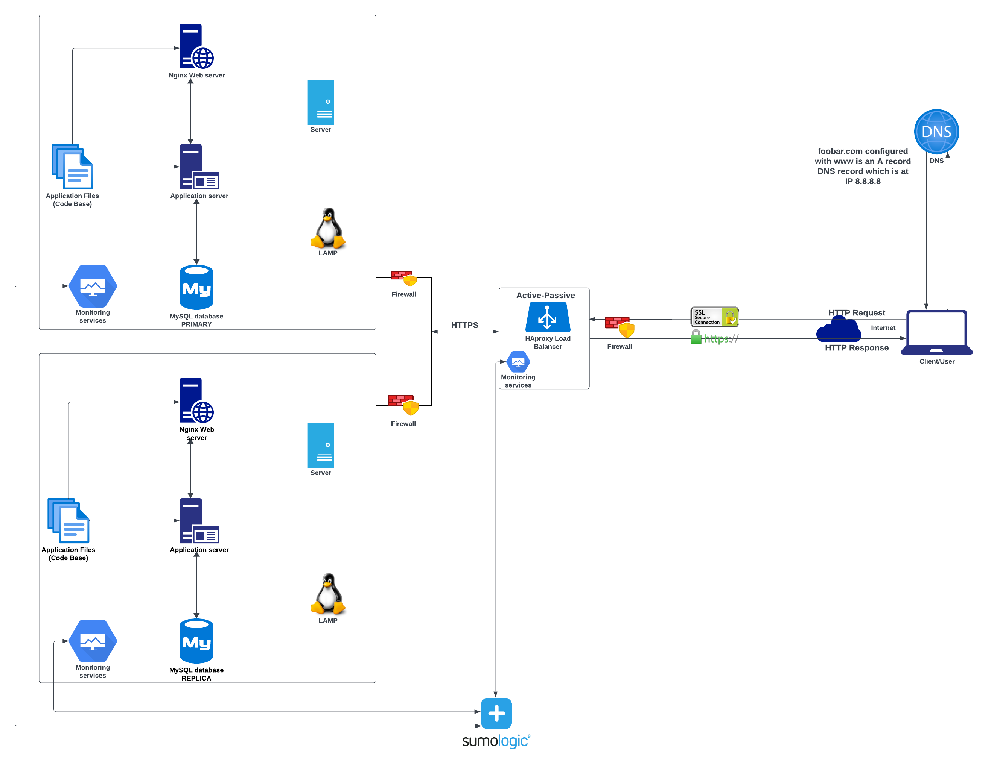

# Secured and monitored web infrastructure

[view whiteboard](https://imgur.com/a/tdi7U0T)

## Task Description
This is a project that describes a secured and monitored web framework hosting a website accessible through 'www.foobar.com'. This 3-server web infrastructure is secured, monitored and serves encrypted traffic. The following are the requirements of this secured and monitored web infrastructure;
- 3 firewalls
- 1 SSL certificate to serve www.foobar.com over HTTPS
- 3 monitoring clients (data collector for Sumologic or other monitoring services)

## Explanation of the Infrastructure specifics
- **Firewall(What are firewalls for?)**  
A firewall is a network security device that monitors network traffic and decides how to handle the traffic based on set security rules. In this web framework, there are three firewalls one before the load balancer and and one each before the server monitoring the traffics in and out of the servers.
- **SSL Certification(Why is the traffic served over HTTPS?)**  
The SSL certificate is a data file hosted in a website's origin server that authenticates a website's identity and enables an encrypted connection. The SSL certifcate used in this web framework is for encrypting the traffic between the web servers and the external network. The SSL certificate ensures privacy, integrity and identification.
- **Monitoring(What monitoring is used for?, How the monitoring tool is collecting data?, Explain what to do if you want to monitor your web server QPS?)**  
Monitoring is a process of tracking, observing and measuring the processes and operations of a server. In this web framework, the monitoring services are used for monitoring the servers and the external network, they observe the servers and provide key metrics about the operations on the server to the administrators. The monitoring services also tests the accessibility of the servers, measures response time, and alerts for errors such as security vulnerabilities, missing files and many other issues. In order to monitor the web server QPS, a monitoring tool is installed and metircs export is installed on the web serve which is integrated with the monitoring tool, then a QPS dashboard is setup and finally alert rules are defined for effective web server QPS monitoring.

## Issues with this distributed web infrastructure
- **Load balancer SSL termination(Why terminating SSL at the load balancer level is an issue?)**  
In this web infrastructure, terminating SSL at the HAproxy load balancer level would leave the traffic between the load balancer and the web servers unencrypted.
- **One database with write authorization(Why having only one MySQL server capable of accepting writes is an issue?)**  
The web framework has one MySQL server capabale of accepting write authority making it unscalable and this is a Single Point of Failure(SPOF).
- **All components server(Why having servers with all the same components (database, web server and application server) might be a problem?)**  
Having uniform server components can cause resource contention, impair performance and hinder problem identification, making such a setup less scalable.
