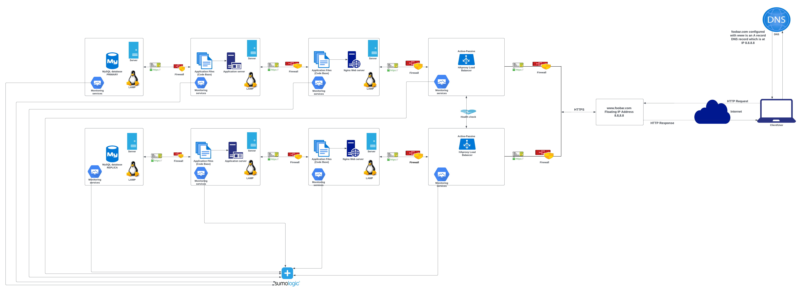

# Scale up web infrastructure

[view whiteboard](https://imgur.com/a/0erUeW8)

## Task Description
This is a project that describes a scaled up web framework hosting a website accessible through 'www.foobar.com'. This is a multiple server scaled up web infrastructure with the following additional requirements to the other web infrastructures discussed in this directory;
- 1 server
- 1 load-balancer (HAproxy) configured as cluster with the other one
- Split components (web server, application server, database) with their own server

## Explanation of the Infrastructure specifics
- **Additional Element**  
This scaled up web framework, has additional firewalls and SSL certificates across all server, additional monitoring services all connected to a data collector and an health check monitor for the two HAproxy load balancers. The inclusion of these additional elements protects the servers from unauthorised users. Also a good monitoring of the servers and load balancers makes it easy to determina any issues with the servers.
- **Spliting Components**  
The web server, application servers and databases have their own server, thereby increasing the performances of each of the server, making them more reliable and functional.

## Issues with this scaled up web infrastructure
- **High Cost and Maintenance**  
Due to the spliting of components, the cost of the servers and multiple components makes the web framework expensive. Also the availability of monitors for each servers, makes it very expensive to maintain and thereby increasing the cost of maintenance.
