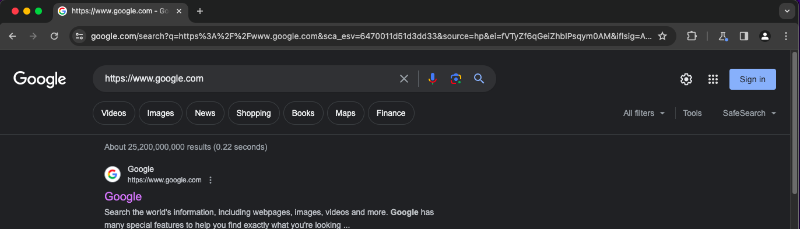
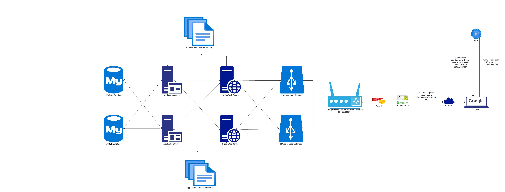
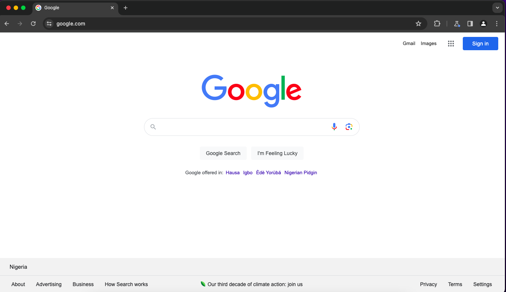
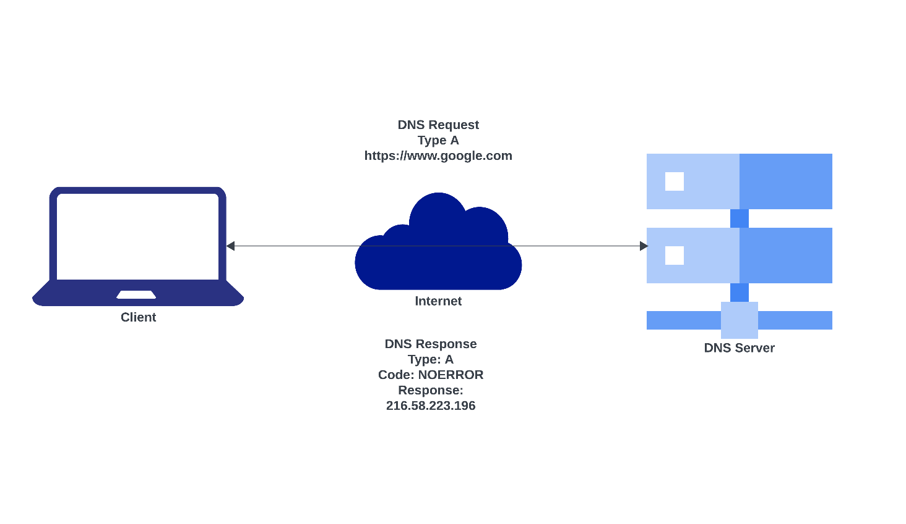
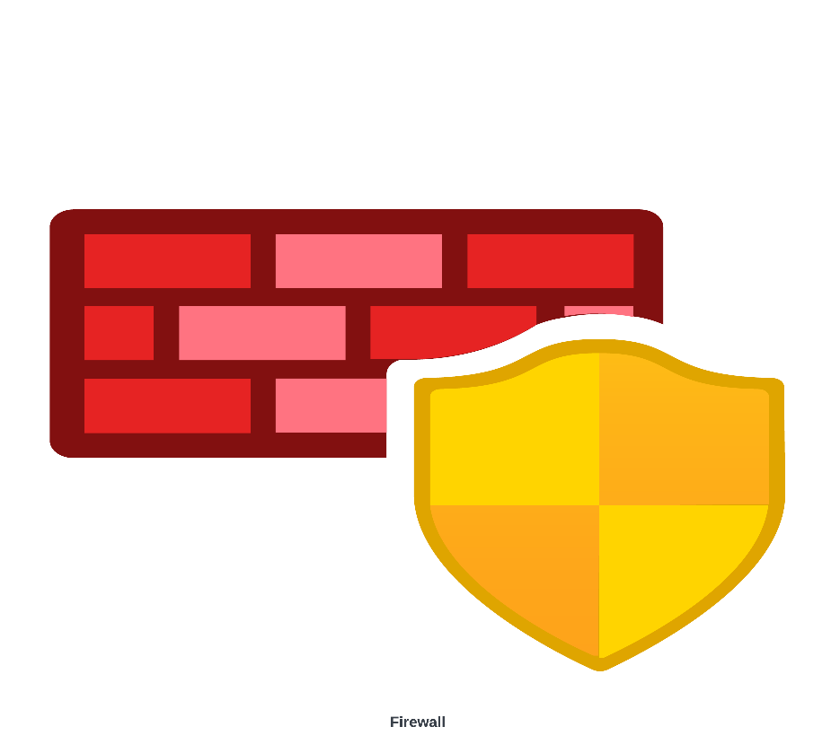
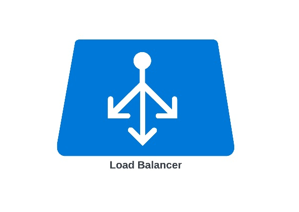

# What happens when you type https://www.google.com into your browser and hit Enter?

Google *https://www.google.com* query

Per second, *https://www.google.com* is queried over 99,000 times with the reply in less than half a second. But within those micro seconds, what exactly happens? Well several processes and steps have taken place which will be broken down for easier understanding. But before that, below is a quick diagram of the behind the scenes process it takes to deliver the web page *https://www.google.com*

Schematic diagram of a client-server interaction for *https://www.google.com*

Looking at the diagram above, we can deduce some key concepts and takeaways that will be considered extensively to give a work through of what happens when you type *https://www.google.com* into your browser and hit Enter. These concepts include;
- DNS request
- TCP/IP
- Firewall
- HTTPS/SSL
- Load-balancer
- Web server
- Application server
- Database

Using these concepts we will see a journey through which the request for the web page *https://www.google.com* results in the image below.

Google Homepage

**Domain Name System (DNS) Request:**  
Domain Name System, also known as DNS is like the internet’s bookkeeper, where the unique identifiers (IP address) for the websites’ servers are stored. Hence, the DNS serves as the internet phonebook, keeping the numbers (IP address) of the domain name that is typed into the browser of your computer.

A DNS request is therefore a process of getting the IP address of a website domain name from the DNS server. A good example of this process is when you try to call a friend from your phone, you can easily get the friend’s number by typing the name in the search space of your phone’s contact and then the number is visible for you to use. Below is a DNS request for the domain name *(www.google.com)*:

DNS request

**TCP/IP:**  
Transmission Control Protocol/Internet Protocol also known as TCP/IP are the set of rules or instructions that control how data is transmitted over the internet. The Transmission Control Protocol (TCP) ensures whatever is transmitted is delivered reliably and in the correct order while the Internet Protocol (IP) handles how data packets are routed between devices on the internet.

A good example signifies how individuals of the same locality communicate in the language that is most suitable to them, hence ensuring their communication is intact and very understandable. Hence, TCP/IP serves as the language devices use to communicate over the internet where TCP makes sure messages arrive intact and in the right order, while IP ensures that the right response is delivered to the right destination or device.

**Firewall:**  
A firewall is regarded as a barrier or security in the digital world that protects the computer or network from malicious and unauthorised attacks. The major function of a firewall is to scan through incoming and outgoing requests over the network, thereby allowing only trusted data to go through while blocking possibly harmful traffic.

Firewall

Just like the security guard in a building or a bouncer in a club, the firewall is regarded as the security guard of your network filtering through incoming and outgoing traffic over your network.

**HTTPS/SSL:**  
Hypertext Transfer Protocol Secure also known as HTTPS is a more advanced and protected version of HTTP. What this does is to transfer data between the browser and the web server in an encrypted format to prevent unauthorised access and ensures a secure connection.

HTTPS/SSL

While HTTPS serves as a digital lock encrypting data, this encryption is made possible by Secure Sockets Layer also known as SSL. This is succeeded by Transport Layer Security (TLS), however they both have the same function of ensuring that sensitive information is hidden from unwanted eyes.

**Load-Balancer:**  
Just as the name implies, a load-balancer’s major function is to divide and conquer, that is split tasks or requests made to servers across various servers in order to manage the influx of traffic. The load-balancer helps distribute requests sent to the servers, ensuring optimal performance hence preventing the server from becoming overloaded.

Load-Balancer

A good example is the traffic light on the road which helps direct cars on when to move hence decongesting traffic and not having a crowded intersection. In the situation of trying to get the webpage *(https://www.google.com)*, Google likely has multiple servers handling requests for *(www.google.com)*, a load-balancer will be used to handle and distribute incoming requests amongst the servers.

**Web Server:**  
A web server provides web pages and various contents to clients, such as web browsers. The software application processes incoming requests, gets the resources of the request and then delivers them back to the web browser over the internet. A good description can be a digital stage where web pages and other contents come to life. Various web servers include Apache, Nginx and others.

Web Server

An example is getting a book at the library, the librarian finds the book and brings it to you. Similarly, the web server functions as the librarian in this case when you input *(https://www.google.com)* into your browser, the web server gets the contents and webpages and sends it to your computer via the internet.

**Application Server:**  
The application server works as a software framework that provides an environment for web applications to run. The application server executes codes to generate personalised content, process search queries and deliver seamless user experience tailored to the needs of the client. The code executed by the application server includes (PHP, Python or Ruby) and this helps generate dynamic content for the web page.

Application Server

Hence, the application server functions as the engine of the request where web application processes are handled in order to deliver dynamic contents based on the input and database queries of the user.

**Database:**  
A database is a structured collection of data organised and stored electronically. This form of storage allows for efficient retrieval and manipulation of data using different queries. In the case of Google’s operations, a database serves as the treasure trove of information waiting to be discovered and queried. Databases store and organise a great amount of structured data, allowing websites to access and manipulate efficiently.

Database

A good example of how a database works is like a filing cabinet, which has various contents stored on the cabinet where various information can be retrieved from, but this time a database is a digital filing cabinet that stores all the data needed for a website or application in an organised and searchable manner. Examples of such data include: accounts, product information, transaction records and so much more.

The processes explained above just shows the cycle of events that takes place when trying to access a webpage and in this case when trying to access *(https://www.google.com)*. This shows in half a second, a lot is going on behind the scenes over the internet to deliver correctly what is requested by the user.
